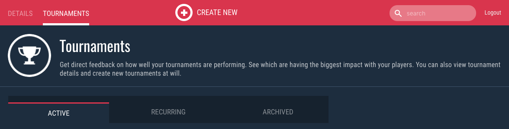
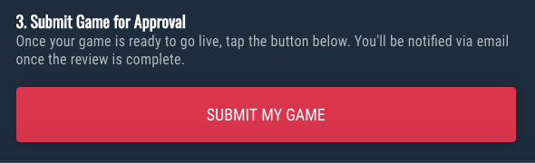
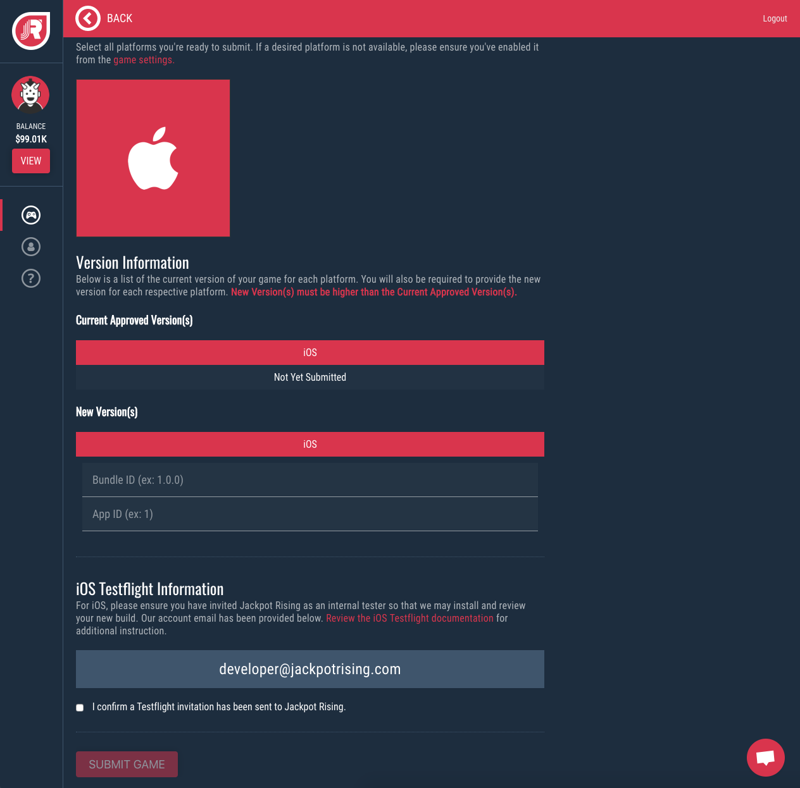
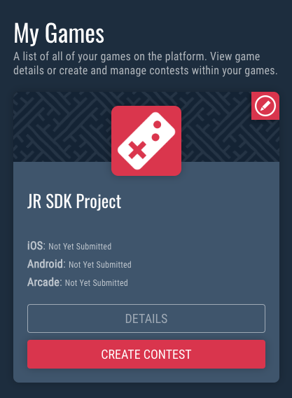
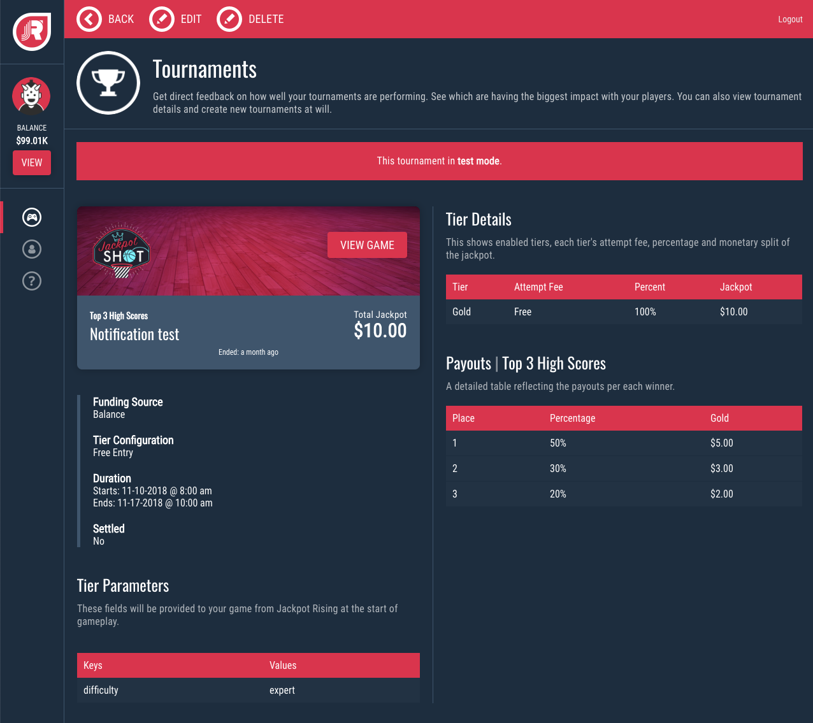
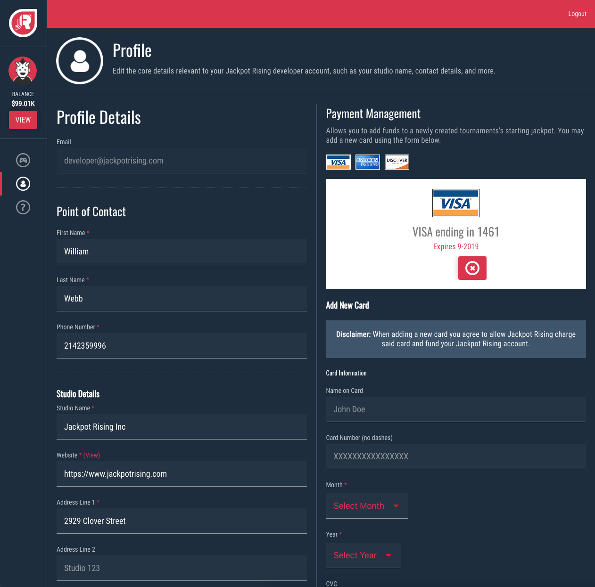
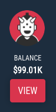
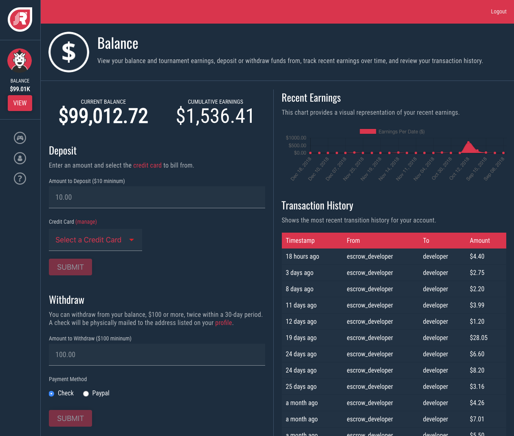

# Homebase Guides

## Submit Game for Review

All games using the Jackpot Rising platform must be approved by a member of our staff. Approve will typically occur within 24 hours of submission. Contact <support@jackpotrising.com> if you need to expedite this process.

!> The test build that you submit to Jackpot Rising for approval must be the same version (i.e 1.0 or 1.1) as the production build that you are submitting to Apple.

#### 1. Select Your Game

Select your game by tapping the **Details** button

#### 2. Create a TEST Tournament

For detailed instructions, please see [Creating a Tournament](homebase/integration?id=create-a-tournament)

#### 3. Submit for Approval

Once you have created a test tournament, return to the Game Details page and tap **Submit My Game.**

#### 4. Provide Game Details

1. Select the platform(s) that you will be submitting for the game.
2. Provide the version number and app details for the build that you are submitting.
3. For iOS: Send an invitation through Testflight to <developer@jackpotrising.com>

> Your point of contact email (set within Homebase > Account) will be notified once the approval is complete. If denied, a reason will be provided. If accepted, the game will then appear in the Jackpot Rising games library.

---

## Monitoring Tournaments

#### 1. Select Your Game

Select your game by tapping the **Details** button

#### 2. Select a Tournament

Find your tournament in the list of active, recurring, or archived tournaments. Then tap the **View Details** button.

#### 3. Review a Tournament

On this page you can view live tournament information, including the leaderboard standings (not pictured).

---

## Managing Account and Funds

### Manage Account Information

The Account section is where you can view and edit the details for your point of contact, studio, and payment methods.

### Deposit, Withdraw, and More

Start by tapping the **View** button on the left side of the page. 

Here you may add or withdraw funds from your account and view a transaction history and recent earnings.

