# Homebase Integration

## Register

## [https://homebase.jackpotrising.com](https://homebase.jackpotrising.com ':target=_blank')

> Tap the **Register** button and complete all required fields.

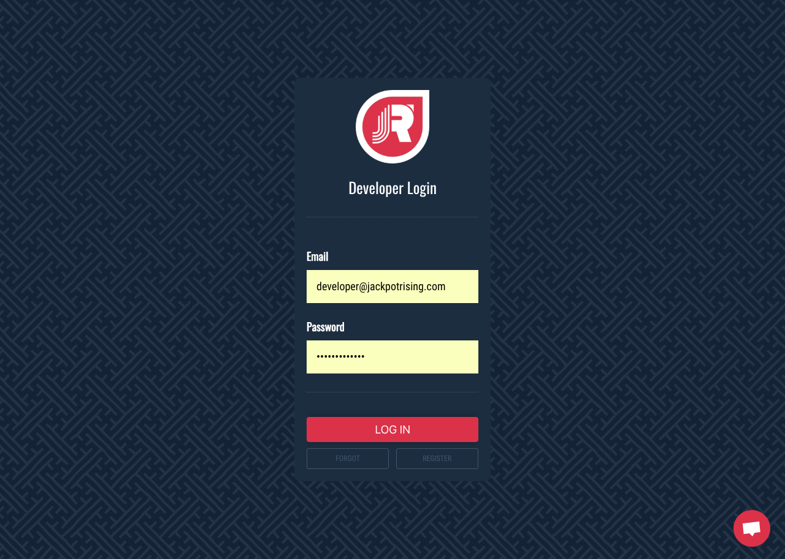

---

## Add a Game

Login to [Homebase](https://homebase.jackpotrising.com ':target=_blank') and tap the **Add Game** button at the top-left of the page. Provide all required information.

#### 1. Details

Jackpot Rising can use this within the SDK to brand your game on the Jackpot Rising app store.

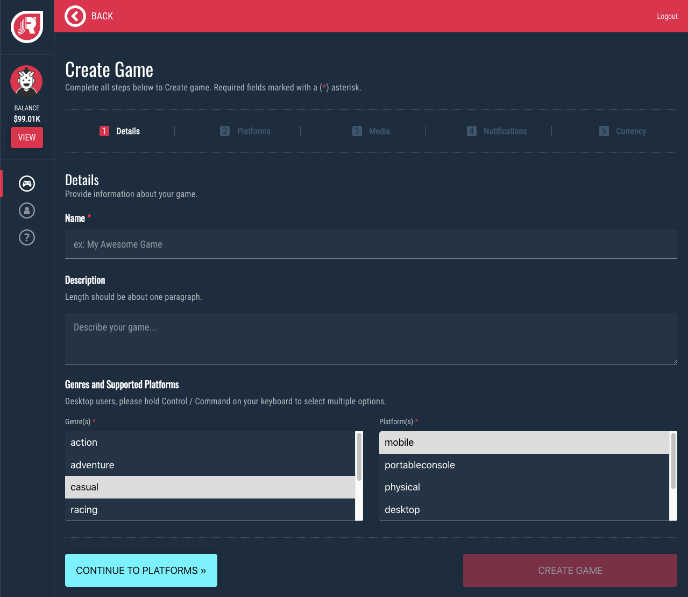

?> You can select multiple Genres or Platforms by holding down **Control/Command**

#### 2. Platforms

Provide additional details per each enabled platform.

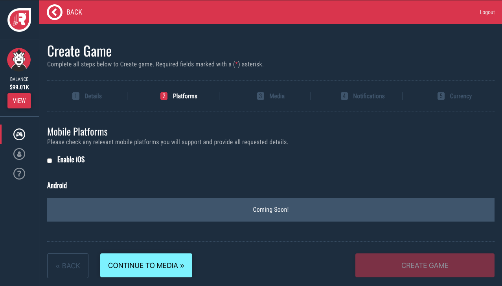

> Selecting iOS will prompt you for your game's **store link** and **bundle**

#### 3. Media

Provide your game's media, including: a video trailer, icon, and backsplash that will be used to brand your game.

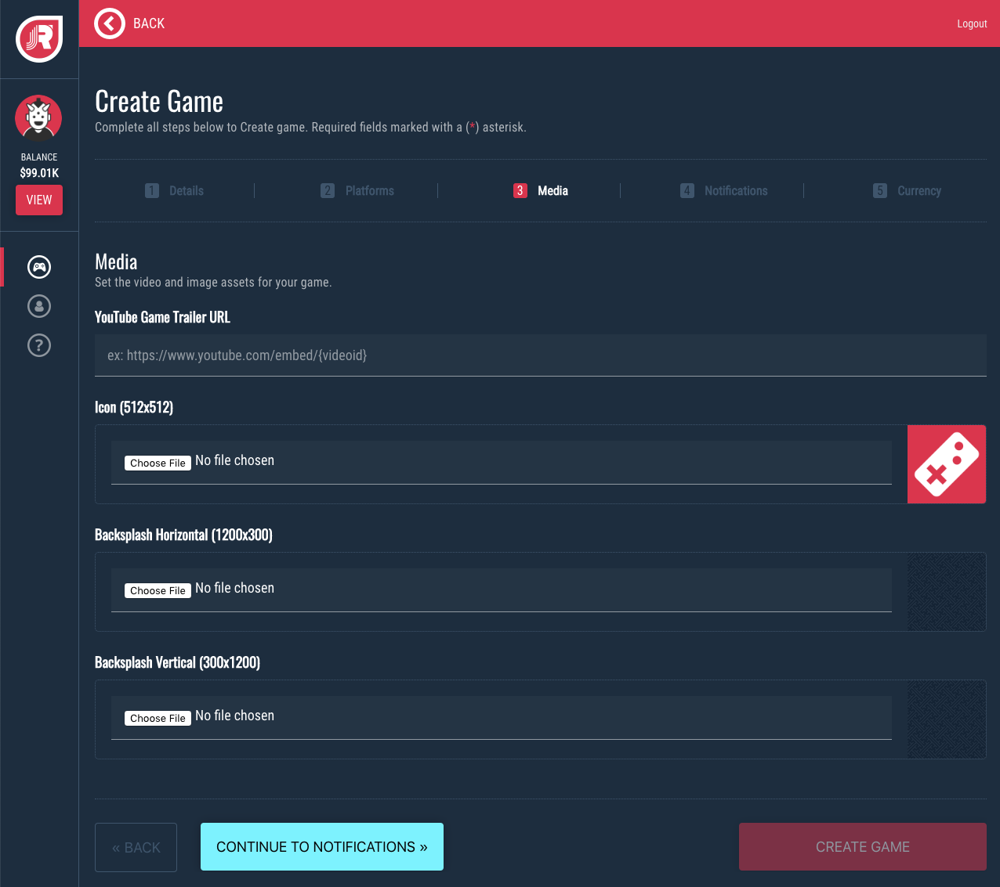

**YouTube Embed URL**
* Navigate to your YouTube video in a browser
* Tap the SHARE option below the video
* Copy the Video ID from the sharable URL (highlighted in red below)
* Create your embed URL using the Video ID like so: `https://www.youtube.com/embed/{videoid}`

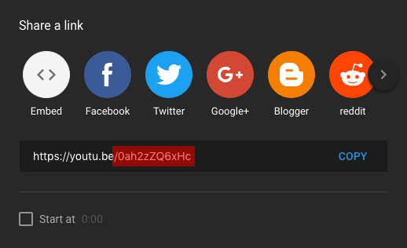

?> You may open the generated URL directly in your browser to test it

**Image Size Requirements**
* Game Icon: 512x512
* Backsplash (Horizontal): 1200x300
* Backsplash (Vertical): 300x1200

!> Your backsplash image is intended to be overlapped by other UI elements. This is not a banner and should not include text or other prominent imagery

#### 4. Notificiations (optional)

You may optionally integrate your [OneSignal](https://onesignal.com/ ':target=_blank') account to enable Push Notifications for your game.

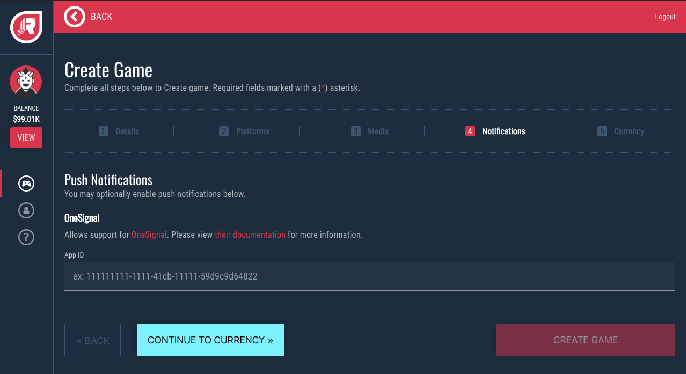

?> Get your OneSignal App ID from the [OneSignal Dashboard](https://documentation.onesignal.com/docs/accounts-and-keys#section-keys-ids ':target=_blank')

**Notification Examples**

* New tournament added
* Tournament ending soon
* Player was knocked out of the money
* Tournament completed

> By default only the **new tournaments** notification is enabled for players. We limit the number of notifications to reduce spam and encourage engagement

#### 5. Currency (optional)

If you plan to use a custom game currency in place of real money, provide your assets here.

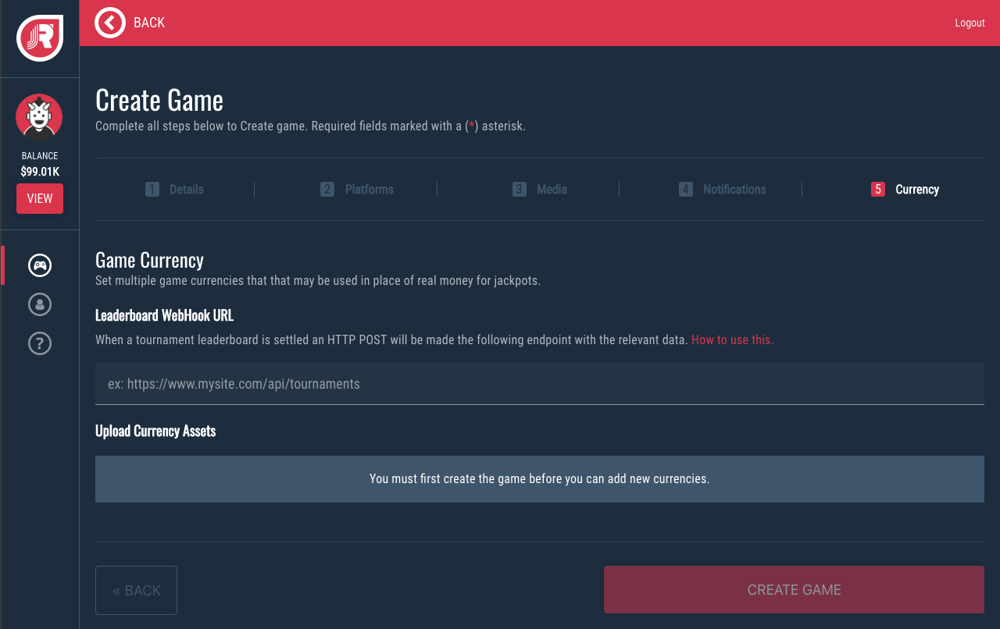

#### 6. Create Game

Tap the **Create Game** button to complete this process.

---

## Generate SDK Credentials

Each game has a unique set of SDK credentials that help authenticate and connect it to the Jackpot Rising platform. Follow the instructions below to retrieve your game's SDK credentials.

Start by tapping the **Games** navigation section.

Select your game by tapping the **Details** button

Generate your Developement and Production SDK keys from the section displayed below.

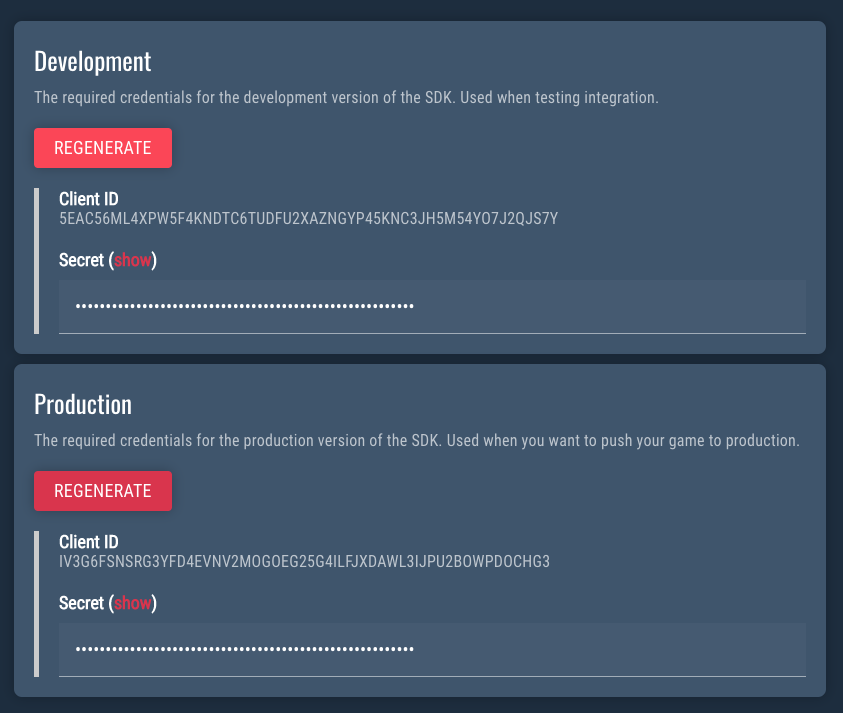

!> You'll need these credentials when integrate your game in Unity or other platforms

---

## Create a Tournament

Start by selecting your game, tap the **Tournament** tab along the top of the screen, then select **Create New**

#### 1. Core Settings

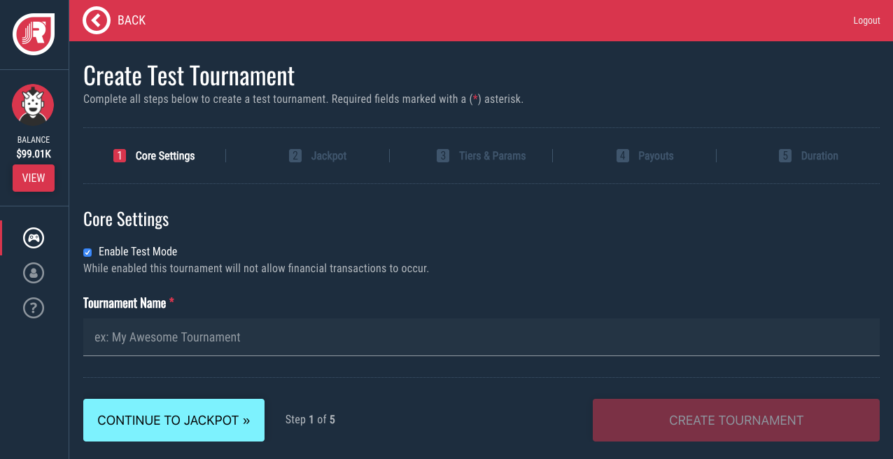

**Standard vs Test Mode Tournaments**

There are several key differences between Standard and Test Mode Tournaments:

* Test Mode acts as a sandbox mode for testing tournaments internally or when submitting for approval.
* Test tournaments do not deduct funds from an account or credit card.
* Test tournaments do not use GPS Location, so you can play from any location.
* Players will never see Test Mode tournaments, since they're limited to Test Mode games

!> Note: Games must be built with a Test Mode flag enabled to make Test tournaments visible.

**Tournament Name**

This is a unique identifier for the tournament which is visible to players.

> Avoid using "Tournament" in the name if possible. DO NOT include "Tournament" for recurring tournaments. This will be appended automatically.

#### 2. Currency

Set the currency type and initial jackpot amount for your tournament.

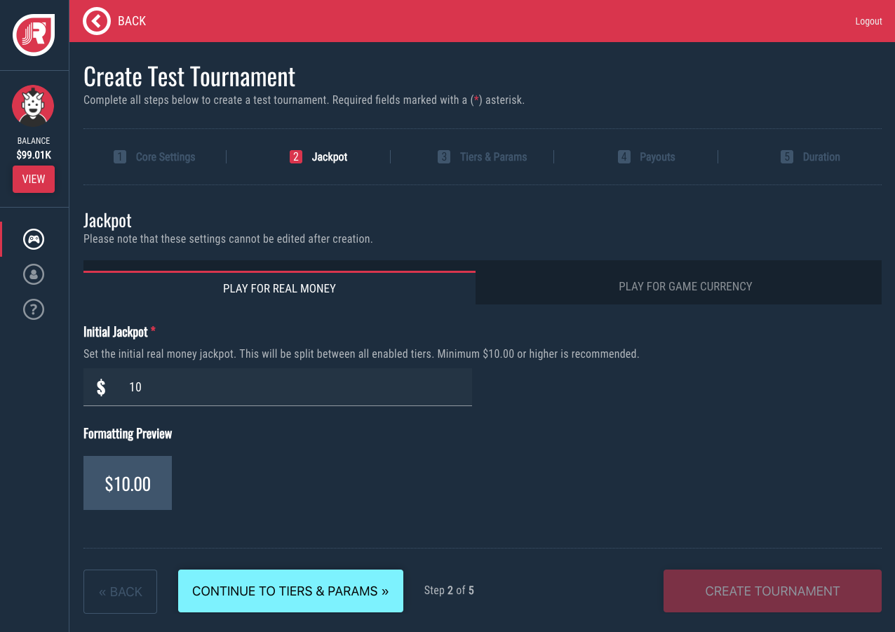

**Currency Mode**

* Real Money - all money in/out will utilize US Dollars (USD)
* Game Currency - this utilizes a custom game currency (ex: gold coins)

?> Game Currency is configured in your Game settings

**Initial Jackpot**

The starting jackpot amount. This will be billed to your account the moment the tournament is created.

#### 3. Tiers & Parameters

Configure jackpot splits, set game parameters, rules, and more.

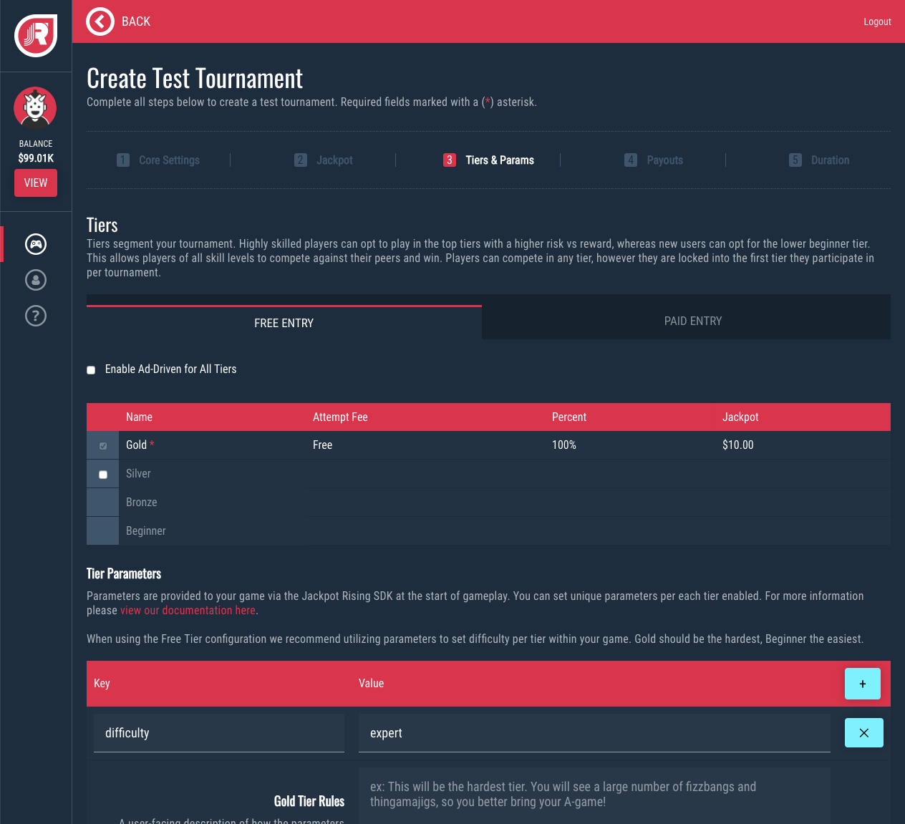

**Free vs Paid Entry**

* Free Entry - does not require a player to pay to participate in a tournament
* Paid Entry - utilizes a progressive system where players pay to make an attempt, however a portion of each attempt increases the total jackpot amount

> The majority of the attempt fee goes to the progressive jackpot, with the rest being split between the developer (you) and Jackpot Rising.

**Ad Support**

Replaces free entry tiers with ad supported tiers. This allows players to watch video pre-roll ads, which unlock a set number of attempts. A Unity-supported ad network must be integrated to use this feature.

?> See [How It Works](unity/guides?id=how-it-works) for additional information about ad supported tournaments.

**Tiers**

Tiers allow you to split your single tournament's jackpot into mutiple "buckets", which can target players at different skill levels. Higher tiers have a higher attempt fee but reward a larger jackpot payout and vice versa. For paid entry, a free Beginners tier may be enabled to encourage new players.

**Parameters**

Parameters allow you to provide unique key/value data to your tournaments and tiers. This data is provided to your game at the beginning of a tournament attempt. This allows you to tailor your gameplay experience for players per tournament.

?> See [Tournament Parameters](unity/guides?id=tournament-parameters) for more information.

**Rules**

Allows you to provide a plain text explination fo what differentiates the tournament or tiers from standard play. The rules section is also useful to provide the user with overviews, instructions, tips, or details you wish to communicate.

#### 4. Payouts

Defines the payout structure. This is mirrored per each tier.

**Distribution**

The number of awardees per tier.

**Condition**

The win condition per tier.

**Percentage Table**

Shows the payout split for each awardee per tier. When a Custom distribution is selected it allows you to define each percentage amount.

!> Please ensure the the payout for each tier is sufficient. If you have too many tiers or payout spots enabled for the current starting jackpot, then payout spot may receive less than the attempt fee for that tier. If this occurs please reduce the number of tiers/payouts or increase the starting jackpot amount.

#### 5. Duration

Configure the duration of your tournament.

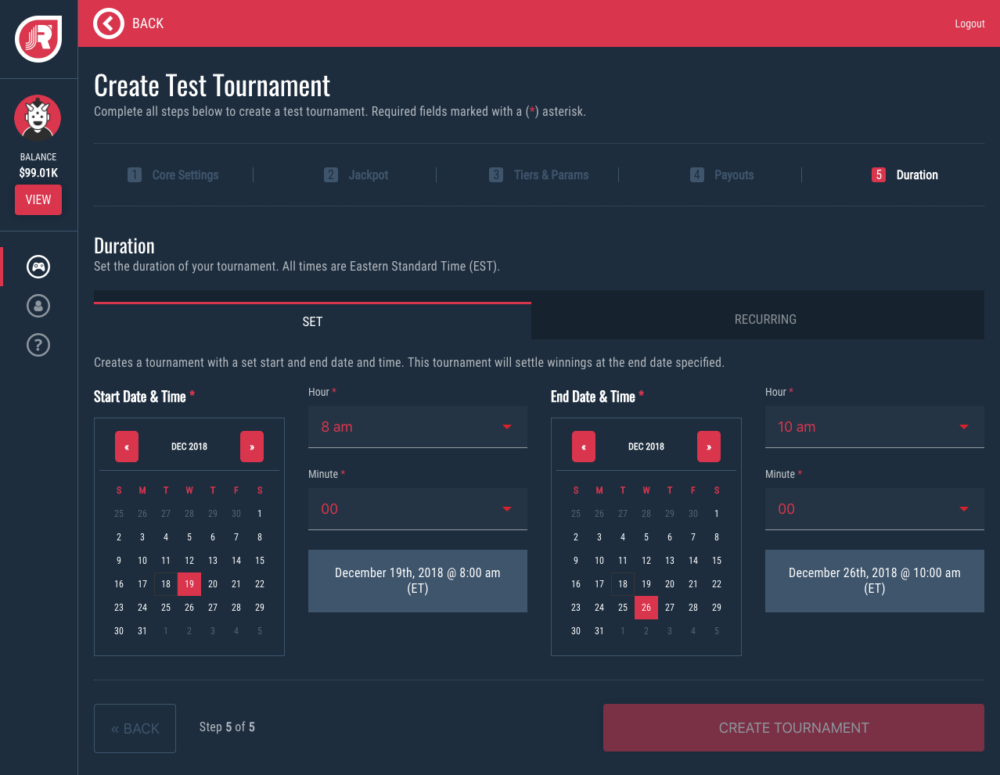

**Set Mode**

The tournament has a defined start and end date/time

**Recurring Mode**

Recreates the tournament repeatedly at defined interval (ex: daily). The tournament name will be auto-generated for Recurring tournaments.

> To stop a recurring tournament, view your game's list of tournaments, select the Recurring tab and press the Delete Template button on the tournament you wish to terminate.

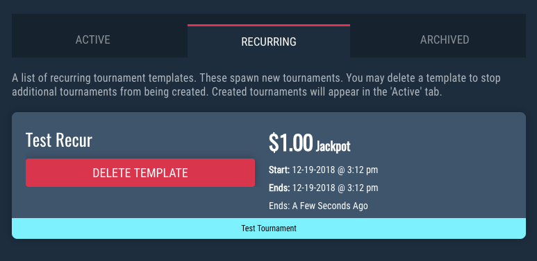
