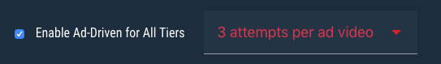

#  Ad Supported Tournaments

## How It Works

Ad supported tournaments give the player freedom to compete in tournaments without feeling obligated to pay-to-play. Players are given the opportunity to watch a video ad in exchange for a set number of tournament attempts.

**Ad Guidelines**

- Rewarded video ads are the required medium for the ad-powered tournaments. 
- Videos must be either 15 or 30 seconds in duration
- Please make sure to align your length of gameplay with the length of the ads you are showing.

?> You may contact <support@jackpotrising.com> regarding recommendations for attempt amounts.

## Revenue Share Methods

Jackpot Rising monetizes through the same revenue share model as paid attempt tournaments. Instead of collecting a percentage of the attempt fees, Jackpot Rising collects a percentage of eCPM revenue generated by the tournament. There are multiple options for this, presented below.


#### Full Integration

Allows for rewarded ad tournaments while your company keeps 100% of the eCPM revenue. Jackpot Rising monetizes these tournaments through a direct partnership with Ironsource.

- [Ironsource](https://www.ironsrc.com/)

?> If you are using full integration, please notify <support@jackpotrising.com>.

#### Partial Integration

Partial Integraiton may be used for any ad network that allows *read-only access* for rewarded ad placements to be shared with third parties. This allows Jackpot Rising to verify and calculate the revenue share for you.

> Tap the **(Guide)** button per each network to learn how to provide read-only access.

- [Unity Ads](https://unity3d.com/unity/features/ads)
- [AdColony](https://www.adcolony.com/) ([Guide](http://support.adcolony.com/customer/en/portal/articles/314059-web-dashboard---sign-up-accounts#s1q6))
- [Admob/Google](https://www.google.com/admob/) ([Guide](https://support.google.com/analytics/answer/2884495?hl=en))
- [Facebook Ads](https://www.facebook.com/business/products/ads) ([Guide](https://www.facebook.com/business/help/adsmanagerbuiltin/596403700379202?helpref=faq_content&rdrhc))
- [Tapjoy](https://home.tapjoy.com/) ([Guide](https://dev.tapjoy.com/faq/user-roles-and-permissions/))
- [Chartboost](https://www.chartboost.com/) ([Guide](https://answers.chartboost.com/en-us/articles/201220135#users))
- [Mopub](https://www.mopub.com) ([Guide](https://www.mopub.com/resources/docs/mopub-ui-account-setup/adding-users-to-your-mopub-account/))
- [AppLovin](https://www.applovin.com/)
- [Vungle](https://www.vungle.com) ([Guide](https://support.vungle.com/hc/en-us/articles/212043807-Dashboard-Accounts-Users))

?> Once you've provided read-only access to any and all ad networks/placements for tournaments, please notify <support@jackpotrising.com>.

#### Manual Processing

If you do not wish to provide Jackpot Rising direct access to your eCPM reports, you may opt to manually provide this information. Jackpot Rising will then calculate an charge you a eCPM rate based on the number of completed ad impressions.

?> Jackpot Rising eCPM rates are based on current market rates for Rewarded Ad videos. For more information please contact <support@jackpotrising.com>

---

## Ad Integration


#### 1. Enable Ad Support for a Tournament

When creating your tournament within Homebase, ensure you've enabled the **Ad Support** option from the Tier and Parameter options.



**Free vs Paid Entry**

- Free Entry: allows you to enable ads for ALL tiers
- Paid Entry: allows you to enable ads only for the Beginner tier

**Attempts**

This is the number of attempts a player will be rewarded after viewing an ad.

#### 2. The PlayAd() Callback

```csharp
    public void PlayAd(){
        // Trigger ad network code here
    }
```

The [The Tournament Listener](unity/integration?id=optional-methods) provides a `PlayAd()` callback, which will be called by the Jackpot Rising SDK when a player is attempting to initiate an ad-supported tournament or tier. This is where you should initiate your integrated ad network.

?> The process is demonstrated and logged in the Unity editor's Play mode through a JRSimulator, which allows you to quickly debug the process.

#### 3. Inform the SDK of Ad Success/Failure

Once the ad has been triggered, notify the SDK of success or failure via:

```csharp
    JackpotRising.SubmitAdSuccess(bool)
```

* Pass `true` if the ad played successfully
* Pass `false` if the ad failed or was interrupted

Once your game notifies the SDK of the ad success/failure, the player will once again see the Jackpot Rising tournament listing and will be notified if, and how many, attempts they just received for watching the ad.

> Since these are reward ads, the ads should NOT be skipped. However, this depends entirely on your ad network and configuration. Jackpot Rising does not control the ad, but rather ensures the player receives their attempts from successfully watching an ad.

#### 4. Starting an Attempt

The standard [Attempts and Scores](unity/integration?id=attempts-and-scores) process will be used from this point forward.
 The player may choose to use an attempt and begin the tournament, which will call `StartTournament()` as normal.

 ---

## Additional Support

Below are additional resources and information for getting the most out of your ad supported tournaments.

#### Helpful Articles

- [Succeed With Rewarded Video](https://www.mopub.com/2017/08/01/rewarded-video-placements/)
- [Maximize Revenue With Mobile Video Ads](https://www.chartboost.com/products/video/)

#### Frequently Asked Questions

**Can I mix Full, Partial and Manual Process integration methods for multiple networks?**

Yes. Just notify <support@jackpotrising.com> of any and all ad networks you plan to use for rewarded ads. You will be charged as detailed in [Revenue Share Methods](unity/ads?revenue-share-methods).

**What if there is a discrepancy between the ad network's report and Jackpot Rising ad completion count?**

There may be minor discrepancies when tracking impressions. If the difference is negligible, then Jackpot Rising will defer to the metrics reported by the ad networks. If the difference is deemed to be significant, then Jackpot Rising will defer to internal metrics, unless the issue can be resolved by the partner and Jackpot Rising.
