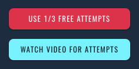
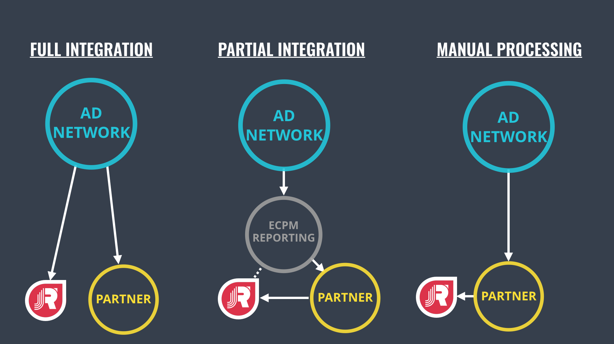

# Unity Guides

## Game Randomization

!> **You are required to use this if your game has random variables that affect gameplay.**

For games that utilize procedural or randomally generated content please ensure the randomized values for dynamic gameplay remain identical for every player and attempt made in that specific tournament. This ensures your tournament is legally compliant and meets the definition of a 'game of skill'. In short, it's fair and equal to all players that participate.

To help accomidate this the Jackpot Rising SDK provides two helper methods.

#### Sequence Randomized

Sequenced randomization should only be used for generated numbers that affect actual gameplay and and have an effect on the outcome of the result of an attempt. This should not be used for aesthetic effects such as particle generation, graphics, or other non-essential random values.

```csharp
// Values between 0.0 and 1.0
JackpotRising.GetRandomValue();

// Integer values between a low and high number
JackpotRising.GetRandomRange(int low, int high);
```

#### Seed Randomized

As long as the calls are made in the same order, they will produce the same ‘randomized’ values for every player playing in the same tournament. You can specify your own seed by replacing `seedVal`:

```csharp
public void StartTournament(long seedVal, ...)
{
    JackpotRising.SetRandomSeed(long seedVal)
}

```

---

## Tournament Parameters

Jackpot Rising tournaments may provide key/value data (aka parameters) at the start of each attempt. Each key/value pair is unique per tier. You may provide an unlimited amount of parameters per tier. If you wish to have the same parameters for all tiers in a particular tournament, then please copy/paste the same key/value data to each tier tab.


This feature is only limited by your imagination! Some example use-cases might include:

- Spawn more enemies or projectiles in the Gold tier vs a Beginner tier
- Change cosmetic details, such a background color
- Change mechanics of the gameplay, such as game speed
- Set the game level that each player participates in, either per tournament or per tier

Once the Jackpot Rising SDK plugin is installed and configured, you can receive the parameter data from the SDK Plugin via `JackpotRising.KeyValues keyvalues` as displayed below:

```csharp
public void StartTournament(long tournamentID, JackpotRising.KeyValues keyvalues)
{
    // ...

    // Handle tournament parameter data here.
    GameEventsManager.level = keyvalues.GetInt("level");
    GameEventsManager.levelName = keyvalues.GetString("name");
    GameEventsManager.speed = keyvalues.GetFloat("gameSpeed");

    // ...
}
```

---

## Ad Supported Tournaments



Ad supported tournaments give the player freedom to compete in tournaments without feeling obligated to pay. Players are given the opportunity to watch an ad in exchange for a set number of attempts.

This requires a bit more setup but allows you to integrate with any Unity-supported reward ad network, including Unity Ads, Admob, etc.

#### 1. Enable Ad Support for a Tournament

When creating your tournament within Homebase, ensure you've enabled the **Ad Support** option from the Tier and Parameter options.



**Free vs Paid Entry**

- Free Entry: allows you to enable ads for ALL tiers
- Paid Entry: allows you to enable ads only for the Beginner tier

**Attempts**

This is the number of attempts a player will be rewarded after viewing an ad.

#### 2. The PlayAd() Callback

```csharp
    public void PlayAd(){
        // Trigger ad network code here
    }
```

The [The Tournament Listener](unity/integration?id=optional-methods) provides a `PlayAd()` callback, which will be called by the Jackpot Rising SDK when a player is attempting to initiate an ad-supported tournament or tier. This is where you should initiate your integrated ad network.

?> The process is demonstrated and logged in the Unity editor's Play mode through a JRSimulator, which allows you to quickly debug the process.

#### 3. Inform the SDK of Ad Success/Failure

Once the ad has been triggered, notify the SDK of success or failure via:

```csharp
    JackpotRising.SubmitAdSuccess(bool)
```

* Pass `true` if the ad played successfully
* Pass `false` if the ad failed or was interrupted

Once your game notifies the SDK of the ad success/failure, the player will once again see the Jackpot Rising tournament listing and will be notified if, and how many, attempts they just received for watching the ad.

> Since these are reward ads, the ads should NOT be skipped. However, this depends entirely on your ad network and configuration. Jackpot Rising does not control the ad, but rather ensures the player receives their attempts from successfully watching an ad.

#### 4. Starting an Attempt

The standard [Attempts and Scores](unity/integration?id=attempts-and-scores) process will be used from this point forward.
 The player may choose to use an attempt and begin the tournament, which will call `StartTournament()` as normal.
