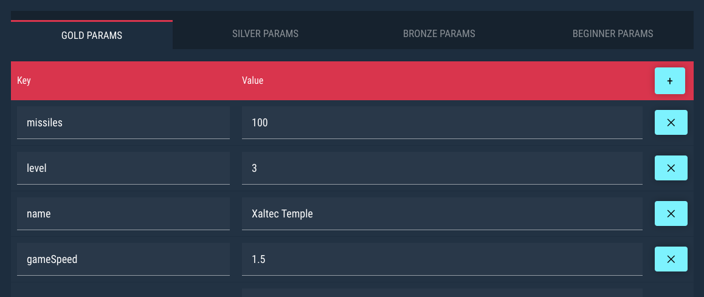

# Unity Guides

## Game Randomization

!> **You are required to use this if your game has random variables that affect gameplay.**

For games that utilize procedural or randomally generated content please ensure the randomized values for dynamic gameplay remain identical for every player and attempt made in that specific tournament. This ensures your tournament is legally compliant and meets the definition of a 'game of skill'. In short, it's fair and equal to all players that participate.

To help accomidate this the Jackpot Rising SDK provides two helper methods.

#### Sequence Randomized

Sequenced randomization should only be used for generated numbers that affect actual gameplay and and have an effect on the outcome of the result of an attempt. This should not be used for aesthetic effects such as particle generation, graphics, or other non-essential random values.

```csharp
// Values between 0.0 and 1.0
JackpotRising.GetRandomValue();

// Integer values between a low and high number
JackpotRising.GetRandomRange(int low, int high);
```

#### Seed Randomized

As long as the calls are made in the same order, they will produce the same ‘randomized’ values for every player playing in the same tournament. You can specify your own seed by replacing `seedVal`:

```csharp
public void StartTournament(long seedVal, ...)
{
    JackpotRising.SetRandomSeed(long seedVal)
}

```

---

## Tournament Parameters

Jackpot Rising tournaments may provide key/value data (aka parameters) at the start of each attempt. Each key/value pair is unique per tier. You may provide an unlimited amount of parameters per tier. If you wish to have the same parameters for all tiers in a particular tournament, then please copy/paste the same key/value data to each tier tab.



This feature is only limited by your imagination! Some example use-cases might include:

- Spawn more enemies or projectiles in the Gold tier vs a Beginner tier
- Change cosmetic details, such a background color
- Change mechanics of the gameplay, such as game speed
- Set the game level that each player participates in, either per tournament or per tier

Once the Jackpot Rising SDK plugin is installed and configured, you can receive the parameter data from the SDK Plugin via `JackpotRising.KeyValues keyvalues` as displayed below:

```csharp
public void StartTournament(long tournamentID, JackpotRising.KeyValues keyvalues)
{
    // ...

    // Handle tournament parameter data here.
    GameEventsManager.level = keyvalues.GetInt("level");
    GameEventsManager.levelName = keyvalues.GetString("name");
    GameEventsManager.speed = keyvalues.GetFloat("gameSpeed");

    // ...
}
```
