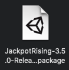
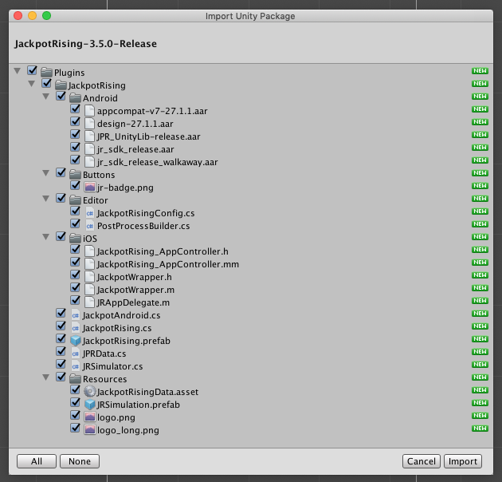
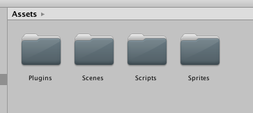
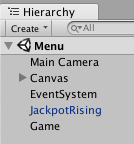
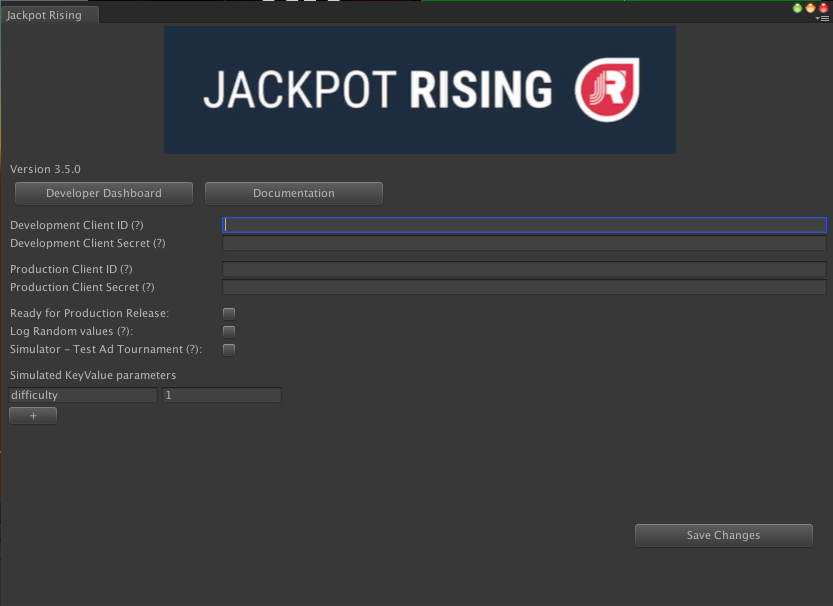
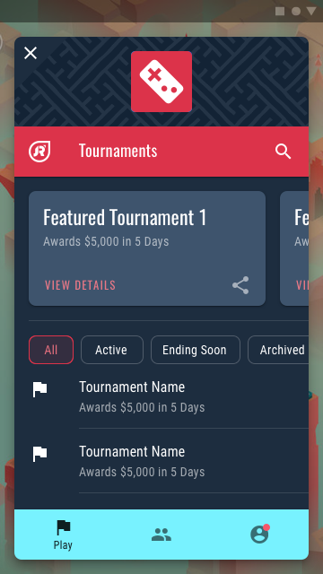
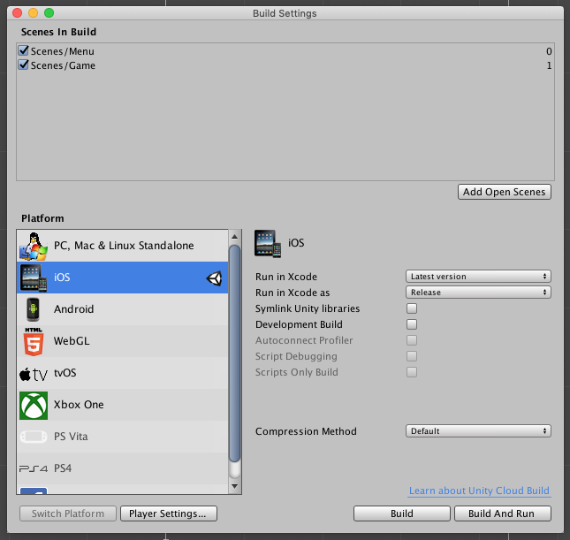
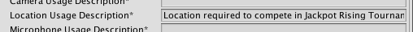
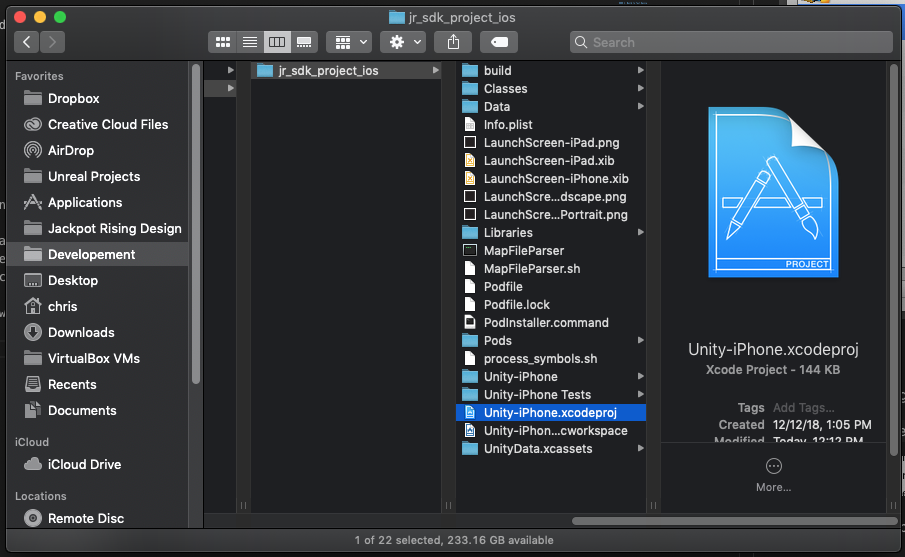

# Unity Integration

## Install the SDK Plugin

!> Please ensure you've reviewed the [Requirements](unity/requirements?id=requirements) section before you begin

#### 1. Download the Plugin

Download the latest version from the [Requirements](unity/requirements?id=requirements) section



#### 2. Install the Plugin

Drag the .package file into your root Assets directory within Unity. Leave everything default and press **Import**.



Once imported, you'll see a new Plugins directory in your Unity project.



Plugins > Jackpot Rising includes:

- Full access to the Jackpot Rising SDK within your C# game scripts
- SDK Configuration panel in *Files Menu > Windows > Jackpot Rising > Edit Settings*
- *Plugins > JackpotRising > Buttons* contains a UI sprite you may use when triggering the SDK

#### 3. Add the 'JackpotRising' Prefab to Your Scene

Find the `JackpotRising` prefab from **Plugins > JackpotRising**, then drag it to your Unity project scene.

?> The prefab will be instantiated as a [singleton](http://wiki.unity3d.com/index.php/Singleton 'target:_blank') and automatically initializing the SDK



> The prefab is required for iOS builds due to how communication works between Unity and iOS.

#### 4. Configure the Plugin

Browse to **Windows > Jackpot Rising > Edit Settings** to view the SDK configuration settings.



**Options Include**

- Developer Dashboard: lauches [Homebase](https://homebase.jackpotrising.com 'target:_blank')
- Documentation: launches this documentation site
- Developer/Production Client ID and Secret: these are covered in the 'Enter SDK Credentials' step below
- Checkbox Options: Hover over the (?) mark for more details. Tap the Production option when you're ready for release.
- Simulate Key/Value parameters : simulates [Tournament Parameters](unity/guides?id=tournament-parameters) 

#### 5. Enter SDK Credentials

?> See [Generate SDK credentials](homebase/integration?id=generate-sdk-credentials) for full instructions on retreiving these.

Tap the **Save** button to complete this process.

---

## Trigger the SDK

!> Ensure you have an active tournament running. See [Create a Tournament](homebase/integration?id=create-a-tournament) for details.

In order the display the Jackpot Rising SDK UI you will need to add an on-screen button. We recommend adding this to your game's main menu.


> A high resolution version of this button can be found in **Plugins > JackpotRising > Buttons**. Though feel free to create a custom button that matches your game's theme

When pressed, the button should trigger the following call. This will trigger the SDK Overlay UI to display:

```csharp
JackpotRising.Show();
```

---

## The Tournament Listener

Most games utilize a custom 'GameManger' script to handle core gameplay logic shared throughout the scope of the game. This is a great place to implement your Tournament Listener (aka Contest Listener). This provides direct access to the bulk of the SDK functionality.

Note the class injects `JackpotRising.ContestListener` in addition to the standard `MonoBehaviour`.

```csharp
public class MyGameScript : MonoBehaviour, JackpotRising.ContestListener {
    // ...
}
```

Key SDK features have been documented within the example GameManger script below:

```csharp
using UnityEngine;

public class MyGameScript : MonoBehaviour, JackpotRising.ContestListener {

    void Start() {
        // Register the listener or it will not receive tournament info!
        JackpotRising.RegisterListener(this);
    }

    // Covered in the 'Attempts and Scores' section below
    public void StartTournament(long tournamentID, JackpotRising.KeyValues keyvalues) {
        // ...
    }
   
    // Insert custom game logic here
    void OnStartGameplay() {
        // ...
    }

    // Add optional methods here
    // Cvered in 'Optional Methods' section below.
}
```

#### Optional Methods

These callback methods are triggered on various SDK state changes and error handling.

**OnSDKFocused()**

Callback when the Jackpot Rising overlay appears and takes control over the application, pausing the main Unity thread while active.

```csharp
public void OnSDKFocused(){}

```

**OnDeclineContestOffer()**

Callback when the player cancels the tournament offer shown from calling `JackpotRising.Show()`

```csharp
public void OnDeclineContestOffer(){}

```

**OnContestLoaded()**

Callback when contest information is loaded and determines what the state of the tournament is. See `JackpotRising.CONTEST_STATUS_ constants` for the states and values.

```csharp
public void OnContestLoaded(int code){}

```

**OnClosedSDK()**

Callback when the Jackpot Rising window is closed with the X button or tournament offer is declined. Unity resumes control of the application when this happens.

```csharp
public void OnClosedSDK(){}

```

**PlayAd()**

Callback when a player attempts to start [Ad Supported Tournaments](unity/guides?id=ad-supported-tournaments)

```csharp
public void PlayAd(){}

```

**OnFailedToInitSDK()**

Callback with a message as to why the SDK failed to initialize

```csharp
public void OnFailedToInitSDK(string message){}

```

Please note that when the **Trigger Button** and **ContestListener** are in place you may encounter a slightly different experience depending on where you play:

* Unity editor game preview: presents a barebones UI that allows you to test SDK features.
* On iOS or Android devices: presents the full SDK Overlay UI. An example is shown below.



> We're always actively deploying new updates to the SDK and UI, so this may differ slightly for your game.

---

## Attempts and Scores

#### 1. Make an Attempt

The following script highlights the `StartTournament()` method used to trigger an attempt. Note the randomization method and tournament parameters are made available before gameplay starts.

```csharp
public void StartTournament(long tournamentID, JackpotRising.KeyValues keyvalues)
{
    // The Tournament ID can be use anywhere within your game
    JackpotRising.SetRandomSeed(tournamentID);

    // Handle tournament parameter data here.
    GameEventsManager.level = keyvalues.GetInt("level");
    GameEventsManager.levelName = keyvalues.GetString("name");
    GameEventsManager.speed = keyvalues.GetFloat("gameSpeed");
    
    // Handle any game specific logic here (change scenes, etc)
    OnStartGameplay();
}
```

?> For more information regarding randomization see: [Game Randomization](unity/guides?id=game-andomization)

?> For more information regarding Key/Value parameters see: [Tournament Parameters](unity/guides?id=tournament-parameters)

#### 2. Submit a Score

After a gameplay, submit the score via the `JackpotRising.SubmitScore()` method:

```csharp
JackpotRising.SubmitScore(long score);
```

---

## Build for iOS

!> Please ensure you have the iOS Build Component installed in Unity before you begin.

!> Please ensure all required Apple Developer provisioning has been setup within Xcode.

#### 1. Set Build Target to iOS

Open **File > Build Settings**, select iOS, then tap the Switch Platform button.



#### 2. Location Text

Open **File > Build Settings > Player Settings > Other Settings > Location Usage Description** add the following text:

> Location required to compete in Jackpot Rising Tournaments



This message will be used when prompting for the location persmission, required for geofencing Jackpot Rising tournaments.

#### 3. Ensure Cocopods is Installed

During the build process we'll utilize Cocopods to install some required resources in your Xcode project. This includes the iOS native SDK Overlay UI.

?> See the [Cocoapods website](https://cocoapods.org/ 'target:_blank') for complete intructions

Enter the following in your terminal to verify Cocopods is installed. If successful a version number will be returned:

```
pod --version
```

#### 4. Build Xcode Project

Tap the Build button and select a destination for your Xcode project.

> During each build process you will see a terminal window open automatically. This is Cocopods installing the required resources. Once complete the Xcode project will open automatically for you. Otherwise double-click 'Unity-iPhone.xcodeproj'.



?> You may close the Cocopods terminal window at this time.


#### 5. Build to Test Device

Once the Xcode project is open, you can either build for a physical iOS device or the Simulator. To do this, select your device and tap the Build and Run option near the top-left of the screen.


Congrats! The Jackpot Rising SDK should now be fully functional within your game. Reach out to any of the [Developer Support](/) channels if you encounter issues or need additional support.

---

## Build for Android

?> Jackpot Rising for Android is still in developement. Please check back soon.
